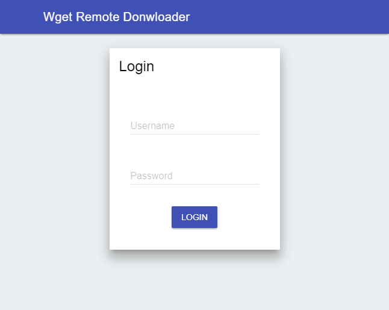
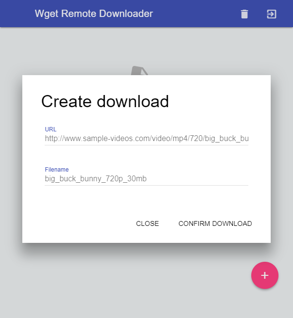
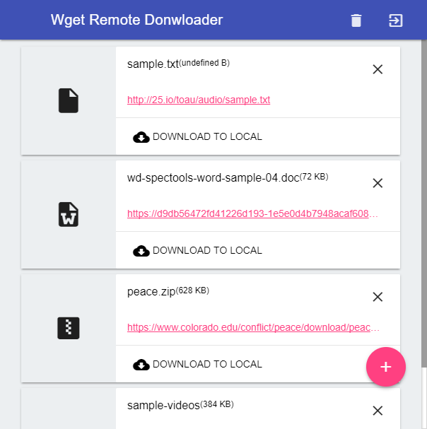

# Wget Remote Downloader [BETA]
This project still under construction.

### Introduction
Home server is a common device nowadays, some of the NAS also contain manageable Linux system. I have a home server too, I use it as a 24x7 router. I think that it can do more things, so i build this remote downloader. Linux wget is a simple & fast download tool. what i need to do is build a web interface to access server storage and wget anywhere.

* _The downloader depended on filebase, no database required._

### Requirement
* A Linux Server that accept wget, ls, head & tail command.
* Apache with URL rewrite Module
* PHP with mcrypt Module

### Screenshot
1. This is how the application look like at first.

2. To create wget download request.

3. Request will be shown like this, after wget finish download. Download to local button will appear.

### How to use
#### 1. Modify startup.php
You can use config tool to create your own startup.php setting.
https://www.vinexs.com/boxset/getting_start

| Param | Description |
| --- | --- |
| url['domain'] | Hosting domain name. |
| url['root'] | Url between domain and index.php, if it is in root of web server, put / in this field. |
| session['token'] | Login cookie name. |
| session['encrypt'] | Login cookie encryption key. |

#### 2. Modify main/settings/accounts.php
| Param | Description |
| --- | --- |
| $SETTING['account'] | Download user and password. |
| $SETTING['file_storage'] | It is where the file will store. |
